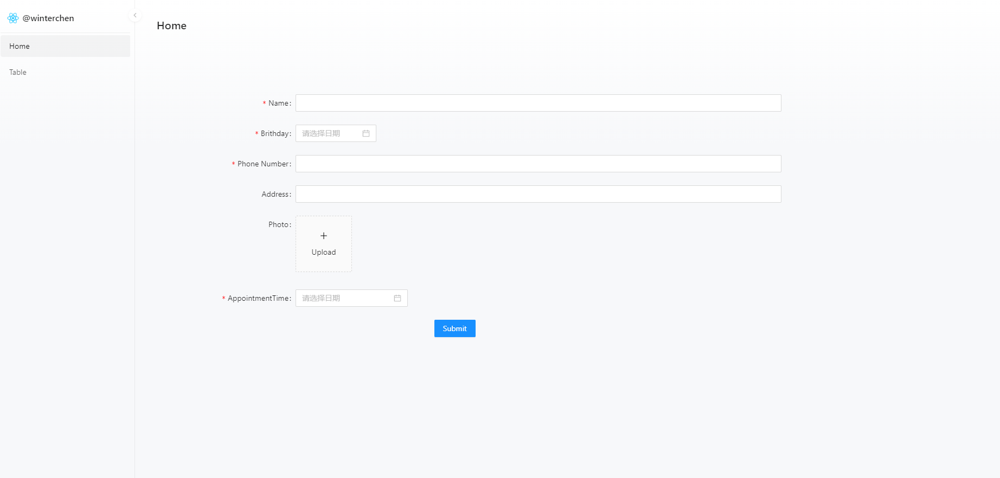
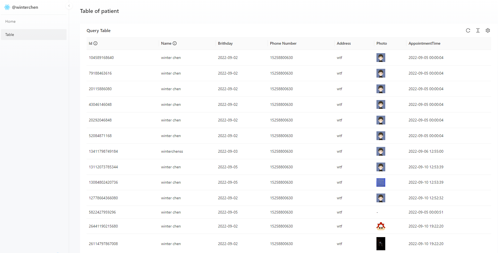

# Getting Started with Patient

## Overview

[](https://github.com/WinterChenS/patient/actions/workflows/main.yml)

this is a simple patient management system. It is a simple application that allows you to create, read patients.

visit the [demo](http://winterchen.com:3002)

visit the back-end [repo](https://github.com/WinterChenS/patient-go.git)


### home page



### table page



## Quick Start

### check out the source code

```bash
git clone https://github.com/WinterChenS/patient.git
```

In the project directory, you can run:

### `yarn`

```bash
yarn
```

### `yarn start`

```bash
yarn start
```

Runs the app in the development mode.\
Open [http://localhost:8000](http://localhost:8000) to view it in your browser.

The page will reload when you make changes.\
You may also see any lint errors in the console.

### `yarn build`

Launches the test runner in the interactive watch mode.
